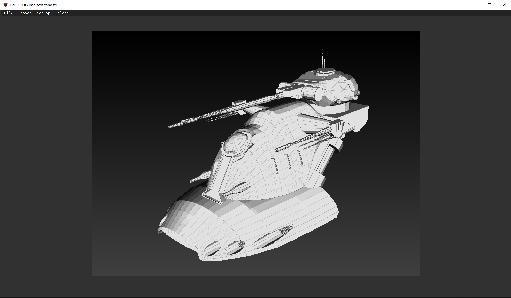
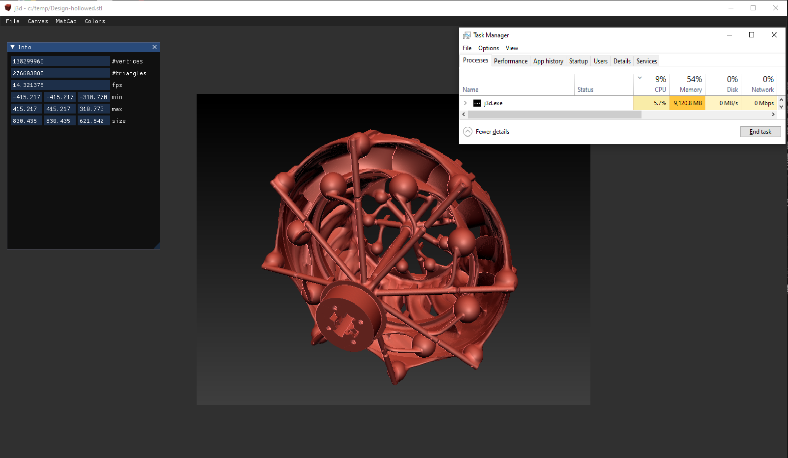
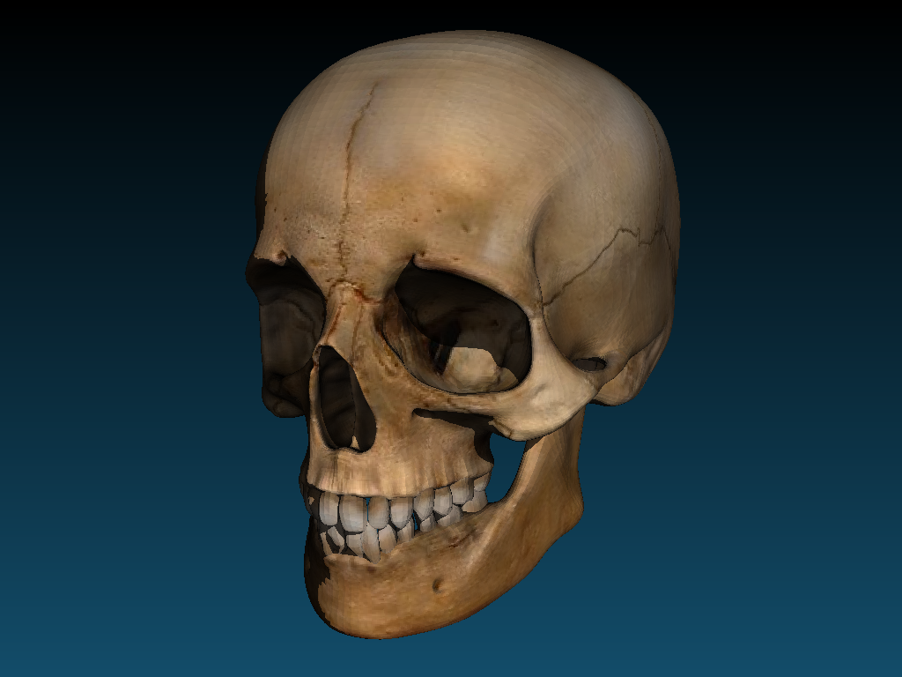
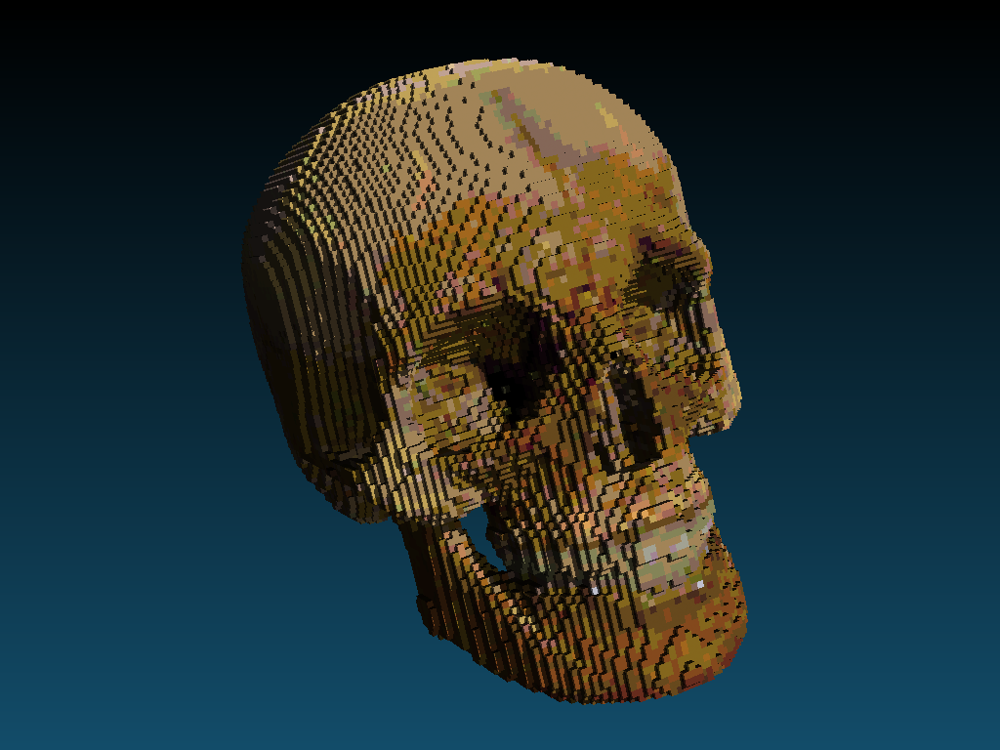
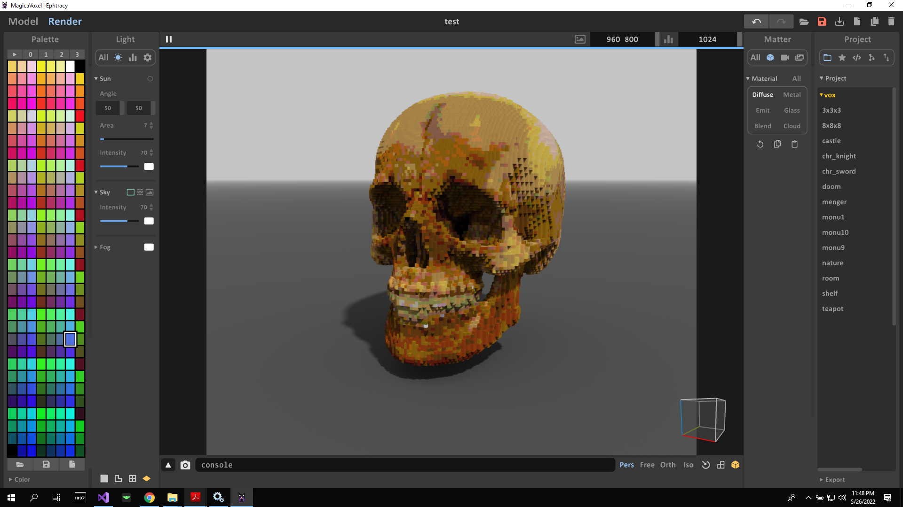

# j3d
3d viewer for ply, stl, obj, vox. Also minor support for gltf and glb.

Introduction
------------

j3d is a simple and straightforward application for visualizing 3d meshes and point clouds. The application uses software rendering so it can be used together with, for instance, Windows Remote Desktop without problems. Furthermore very large files can also be handled provided you have sufficient RAM. You need approximately 39 bytes of RAM per triangle (assuming no textures or vertex colors are present in the file). Thus, you need 11.7Gb of RAM to render a file with 300 million triangles.

Building
--------
First of all, j3d uses submodules, so don't forget to also call

     git submodule update --init

Next, run CMake to generate a solution file on Windows, a make file on Linux, or an XCode project on MacOs.
You can build j3d without building other external projects (as all necessary dependencies are delivered with the code). 

The default multithreading approach uses `std::thread`. There is however the option to use multithreading via [Intel's TBB library](https://software.intel.com/content/www/us/en/develop/tools/threading-building-blocks.html). This is an option in CMake: set the `JTK_THREADING` variable to `tbb`. You will have to make sure that you have the correct dll files and lib files to link with TBB. You can set the necessary variables `TBB_INCLUDE_DIR` and `TBB_LIBRARIES` via CMake.

If you build for a Mac M1 with ARM processor, then set the CMake variables JTK_TARGET to arm.

File format comparisons
-----------------------

The table below compares different file formats that are supported by j3d. We show the time necessary to load the file from disk, and the size that the file format takes on the disk. The comparison is done on a moderately large file, Lucy (see screenshot), from the [Stanford 3D Scanning Repository](http://graphics.stanford.edu/data/3Dscanrep/). This file contains 28 million triangles and 14 million vertices.

File format | Load time | File size
----------- | --------- | ---------
TRC | 0.9s | 268,039 KB
PLY | 2.52s | 520,566 KB
STL | 4.53s | 1,369,910 KB
GLB | 5.6s | 547,965 KB
GLTF | 12.5s | 657,558 KB
OFF | 26.8s | 1,231,375 KB
OBJ | 34s | 1,139,098 KB

Note that, apart from the disk loading time, j3d also spends time to construct a bounding volume hierarchy (bvh) for rendering. The time to generate a bvh for Lucy is about 3.6s.

Large file example
------------------

The mesh in the image below has 276 million triangles. The file can be rendered at 14 fps with resolution 800x600 on an Intel Xeon W-2145 CPU @ 3.70Ghz.

Conversion to MagicaVoxel example
---------------------------------

We start from a Wavefront obj file that was downloaded from https://free3d.com/nl/3d-model/skull-v3--785914.html.

We saved this file as a .vox file, which is the MagicaVoxel file format (https://ephtracy.github.io/). The resolution of the voxel file can be set via the Vox menu. In this example the size of the largest dimension equals 100 voxels.

The generated .vox file can be loaded in MagicaVoxel.

Compressing STL files by a factor 5
-----------------------------------

Load any file, and save it to TRC file format, see [trico](https://github.com/janm31415/trico/).

The following table comes from trico, and shows the compression ratios of the TRC file format. Note that TRC is much faster in compression and decompression than the standard zip algorithm (zdeflate / zinflate). TRC is lossless. The files were taken from the [Stanford 3D Scanning Repository](http://graphics.stanford.edu/data/3Dscanrep/). 

Model | Triangles | Vertices | Binary STL | Binary PLY | Binary PLY zipped | Trico | Compression ratio vs STL | Compression ratio vs PLY | Compression ratio vs PLY zipped
----- | --------- | -------- | ---------- | ---------- | ----------------- | ----- | ------------------------ | ------------------------ | -------------------------------
Stanford Bunny | 69451 | 35947 | 3392 KB | 1291 KB | 522 KB | 571 KB | 5.94 | 2.26 | 0.91
Happy Buddha | 1087716 | 543652 | 53112 KB | 20180 KB | 10135 KB | 9146 KB | 5.81 | 2.21 | 1.11
Dragon | 871414 | 437645 | 42550 KB | 16192 KB | 8129 KB | 7274 KB | 5.85 | 2.23 | 1.12
Armadillo | 345944 | 172974 | 16892 KB | 6757 KB | 3794 KB | 4059 KB | 4.16 | 1.66 | 0.93
Lucy | 28055742 | 14027872 | 1369910 KB | 520566 KB | 296014 kB | 230609 KB | 5.94 | 2.26 | 1.28
Asian Dragon | 7219045 | 3609600 | 352493 KB | 133949 KB | 68541 KB | 49896 KB | 7.06 | 2.68 | 1.37
Vellum manuscript* | 4305818 | 2155617 | 210246 KB | 86241 KB | 42783 KB | 23465 KB | 8.96 | 3.68 | 1.82
Thai Statue | 10000000 | 4999996 | 488282 KB | 185548 KB | 104048 KB | 86165 KB | 5.67 | 2.15 | 1.21

\* the PLY and Trico file contain vertex colors, the STL file does not.

Thirdparty
----------
* imgui (https://github.com/ocornut/imgui)
* json.hpp (https://github.com/nlohmann/json)
* opengametools (https://github.com/jpaver/opengametools)
* SDL2 (https://www.libsdl.org/)
* stb (https://github.com/nothings/stb)
* tinygltf (https://github.com/syoyo/tinygltf)
* utfcpp (https://github.com/nemtrif/utfcpp)
